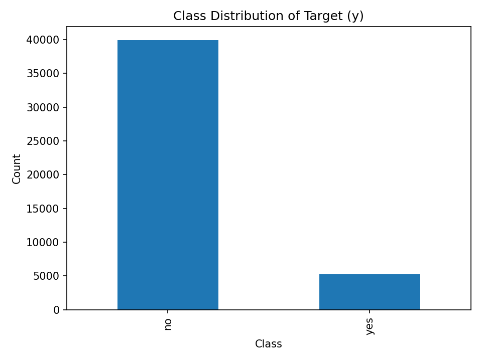
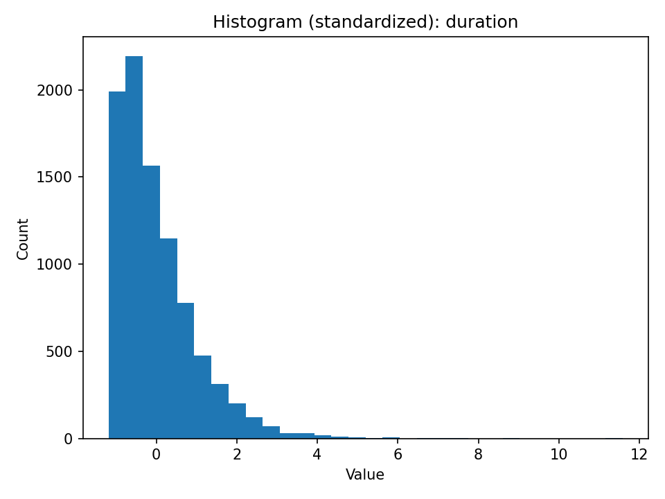
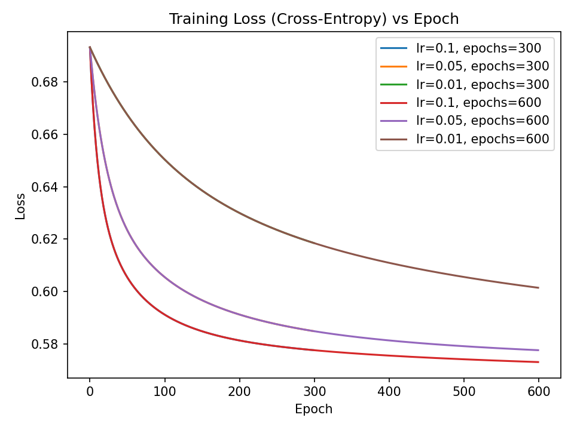
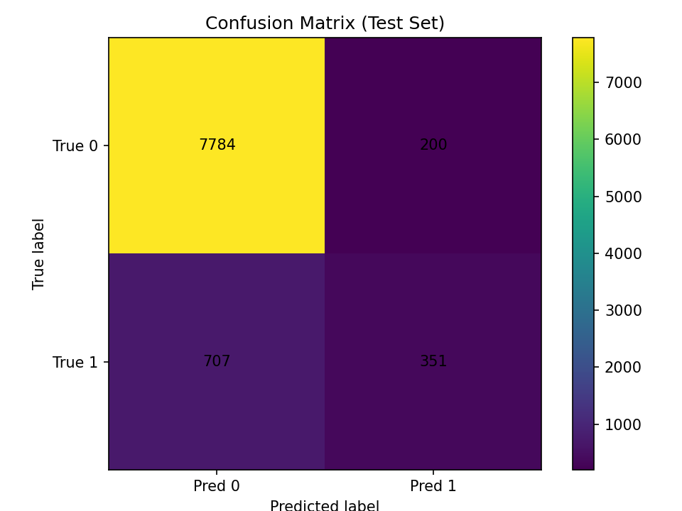
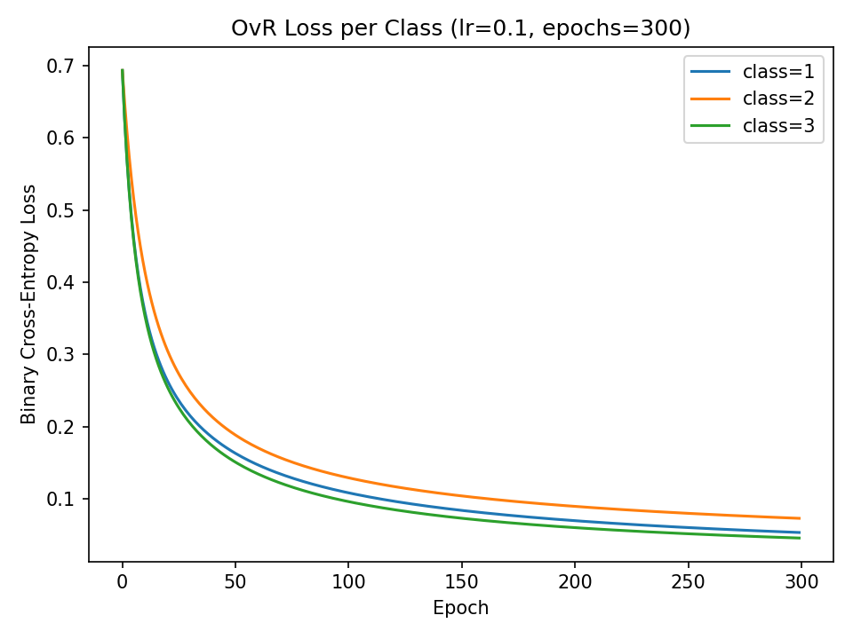
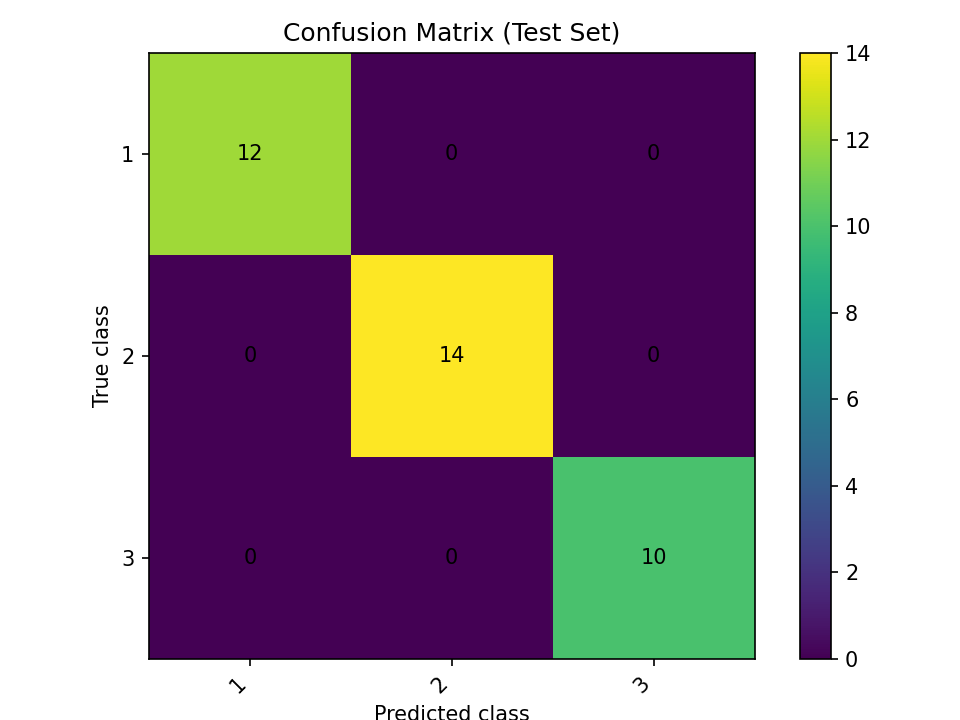

# Statistical Pattern Recognition Homework 1

## Overview

This repository contains a notebook-based machine learning homework project for **Statistical Pattern Recognition**. It implements and analyzes linear regression, binary logistic regression, multiclass logistic regression, and regularized linear regression on tabular datasets.

The project focuses on:

- Exploratory data analysis for tabular datasets.
- Regression and classification models implemented mostly from scratch.
- Train/test evaluation with reproducible random states.
- Visualization of loss curves, class distributions, histograms, and confusion matrices.
- Written PDF reports for each assignment question.

This is a machine learning and data analysis project. The inputs are local CSV datasets, and the outputs are notebook results, saved plots, evaluation metrics, and PDF reports.

## Key Features

- Simple linear regression on the Auto MPG dataset using closed-form solution, Batch Gradient Descent, and Stochastic Gradient Descent.
- Binary logistic regression from scratch on the Bank Marketing dataset.
- Multiclass classification on the Wine dataset using One-vs-All, One-vs-One, and Softmax regression.
- Ridge regression with SGD for studying multicollinearity and coefficient shrinkage.
- Saved visual outputs for class imbalance, standardized feature distributions, training loss, and confusion matrices.

## Project Highlights

- Built end-to-end ML workflows covering data loading, preprocessing, model training, evaluation, and visualization.
- Implemented core regression and logistic regression algorithms from scratch using NumPy-based optimization.
- Compared learning rates, epoch counts, optimization strategies, and regularization strengths.
- Evaluated models using MSE/RMSE for regression and accuracy, precision, recall, F1-score, and confusion matrices for classification.
- Documented assignment solutions in executable notebooks and companion PDF reports.

## Dataset

### Auto MPG

| Item | Details |
| --- | --- |
| Local file | `auto_mpg.csv.csv` |
| Dataset type | Tabular regression |
| Local shape | 392 rows, 4 columns |
| Features used | `weight`, `horsepower`, `displacement` |
| Target | `mpg` |
| Project usage | Question 1 simple linear regression and Question 4 ridge regression |
| Public reference | [UCI Auto MPG Dataset](https://archive.ics.uci.edu/dataset/9/auto+mpg) |

The local file is a cleaned subset containing only the columns used by this homework. In Question 1, `weight` is used as the single input feature to predict `mpg`. In Question 4, `weight`, `horsepower`, and `displacement` are used to predict `mpg`.

Preprocessing found in the notebooks:

- Question 1 uses an 80/20 train/test split with `random_state=42`.
- Gradient-based linear regression standardizes `weight` using training-set mean and standard deviation, then applies the same transformation to the test set.
- Question 4 converts `horsepower` to numeric, drops missing rows if any are produced, standardizes the three input features, and evaluates ridge regression with several regularization strengths.

### Bank Marketing

| Item | Details |
| --- | --- |
| Local file | `bank-full.csv` |
| Dataset type | Tabular binary classification |
| Local shape | 45,211 rows, 17 columns |
| Features | 16 client, campaign, and contact attributes |
| Target | `y`, whether the client subscribed to a term deposit (`yes`/`no`) |
| Project usage | Question 2 binary logistic regression |
| Public reference | [UCI Bank Marketing Dataset](https://archive.ics.uci.edu/dataset/222/bank+marketing) |

Preprocessing found in `2.ipynb`:

- Reads the semicolon-separated local CSV file.
- Converts target labels from `yes`/`no` to `1`/`0`.
- Maps binary categorical variables to numeric values.
- One-hot encodes nominal categorical variables.
- Selects the seven features with the highest absolute correlation with the target:
  `duration`, `poutcome_success`, `poutcome_unknown`, `contact_unknown`, `housing`, `contact_cellular`, and `month_mar`.
- Applies an 80/20 stratified split with `random_state=42`.
- Removes duplicate samples from the training set.
- Standardizes selected continuous numeric features using training-set statistics.

The target distribution is imbalanced in the local file: 39,922 `no` samples and 5,289 `yes` samples.

### Wine

| Item | Details |
| --- | --- |
| Local file | `wine_dataset.csv` |
| Dataset type | Tabular multiclass classification |
| Local shape | 178 rows, 14 columns |
| Features | 13 chemical analysis measurements |
| Target | `class_label` |
| Project usage | Question 3 multiclass logistic regression |
| Public reference | [UCI Wine Dataset](https://archive.ics.uci.edu/dataset/109/wine) |

Preprocessing found in `3.ipynb`:

- Loads 13 chemical features and the `class_label` target.
- Applies label encoding to class labels.
- Uses a stratified 75/25 train/test split with `random_state=42`.
- Removes duplicate rows from the training data.
- Fills missing values using training-set means.
- Optionally removes training outliers using Z-score threshold `2.75`.
- Applies min-max normalization using training-set min/max values and reuses those parameters on the test set.

## Project Structure

```text
HW1/
├── 1.ipynb                         # Question 1: Auto MPG linear regression
├── 2.ipynb                         # Question 2: Bank Marketing logistic regression
├── 3.ipynb                         # Question 3: Wine multiclass classification
├── 4.ipynb                         # Question 4 bonus: Ridge regression with SGD
├── 1.pdf                           # Report for Question 1
├── 2.pdf                           # Report for Question 2
├── 3.pdf                           # Report for Question 3
├── 4.pdf                           # Report for Question 4 bonus
├── Homework1.pdf                   # Assignment specification
├── auto_mpg.csv.csv                # Local Auto MPG dataset subset
├── bank-full.csv                   # Local Bank Marketing dataset
├── wine_dataset.csv                # Local Wine dataset
├── class_distribution_y.png        # Bank target class distribution
├── hist_balance.png                # Standardized balance histogram
├── hist_duration.png               # Standardized duration histogram
├── loss_curves.png                 # Binary logistic regression loss curves
├── confusion_matrix.png            # Binary logistic regression confusion matrix
├── ovr_loss_curves.png             # Multiclass OvR loss curves
├── confusion_matrix_multiclass.png # Multiclass confusion matrix
├── requirements.txt                # Python dependencies inferred from notebooks
├── .gitignore                      # Git ignore rules for Python/Jupyter artifacts
└── README.md                       # Project documentation
```

The repository currently uses a flat structure. This keeps the existing notebook paths valid because the notebooks load datasets directly from the project root.

## Methodology / Workflow

### Question 1: Linear Regression

Notebook: `1.ipynb`

Workflow:

1. Load `auto_mpg.csv.csv`.
2. Explore descriptive statistics, samples, correlations, covariance, and scatter plots.
3. Use `weight` as the input feature and `mpg` as the target.
4. Split data into training and testing sets with an 80/20 split.
5. Standardize the input feature for gradient-descent experiments.
6. Train and compare:
   - scikit-learn linear regression baseline,
   - closed-form normal equation,
   - Batch Gradient Descent,
   - Stochastic Gradient Descent.
7. Evaluate with MAE, MSE, and RMSE.

### Question 2: Binary Logistic Regression

Notebook: `2.ipynb`

Workflow:

1. Load `bank-full.csv`.
2. Inspect data types, class balance, and target distribution.
3. Encode categorical variables.
4. Select top correlated features.
5. Apply stratified train/test split.
6. Remove duplicate training samples.
7. Standardize selected continuous features.
8. Train logistic regression from scratch with binary cross-entropy loss.
9. Compare learning rates and epoch counts.
10. Evaluate accuracy, precision, recall, F1-score, and confusion matrix.

### Question 3: Multiclass Logistic Regression

Notebook: `3.ipynb`

Workflow:

1. Load `wine_dataset.csv`.
2. Compute descriptive statistics.
3. Split with stratified 75/25 train/test split.
4. Clean duplicates and missing values using training-set statistics.
5. Run experiments with and without outlier removal.
6. Apply min-max normalization.
7. Train and compare:
   - One-vs-All logistic regression,
   - One-vs-One logistic regression,
   - Softmax regression.
8. Compare test accuracy, convergence behavior, and computational complexity.

### Question 4: Bonus Ridge Regression

Notebook: `4.ipynb`

Workflow:

1. Load the Auto MPG subset.
2. Use `weight`, `horsepower`, and `displacement` to predict `mpg`.
3. Standardize input features.
4. Analyze multicollinearity using correlation and VIF.
5. Train Ridge regression with mini-batch SGD.
6. Compare regularization strengths `0`, `0.01`, `0.1`, `1.0`, and `5.0`.
7. Report train/test MSE and coefficient shrinkage.

## Visual Results

### Bank Marketing Target Distribution



The Bank Marketing target distribution is highly imbalanced, with many more `no` samples than `yes` samples.

### Standardized Bank Feature Histograms



The standardized `duration` feature remains right-skewed after scaling.


The standardized `balance` feature is also right-skewed, with a long positive tail.

### Binary Logistic Regression Loss



The loss curves compare binary logistic regression training behavior across multiple learning-rate and epoch configurations.

### Binary Logistic Regression Confusion Matrix



The saved test-set confusion matrix for the selected binary logistic regression model is `[[7784, 200], [707, 351]]`.

### Multiclass OvR Loss



The OvR loss curves show binary cross-entropy decreasing for the three one-vs-rest classifiers on the Wine classification task.

### Multiclass Confusion Matrix



The saved multiclass confusion matrix shows correct predictions for all displayed test samples in the saved run.

Additional plots exist as inline notebook outputs, especially in `1.ipynb`, `3.ipynb`, and `4.ipynb`. They are not all saved as standalone image files in the current repository.

## Installation

This project uses Python notebooks. The notebooks were created with a Python 3.11 kernel according to their metadata.

Create and activate a virtual environment:

```bash
python3 -m venv venv
source venv/bin/activate
```

Install dependencies:

```bash
pip install -r requirements.txt
```

## Usage

Start Jupyter:

```bash
jupyter notebook
```

Then open and run the notebooks in order:

```text
1.ipynb
2.ipynb
3.ipynb
4.ipynb
```

The notebooks expect the CSV files to remain in the project root:

```text
auto_mpg.csv.csv
bank-full.csv
wine_dataset.csv
```

## Training / Running the Project

There is no standalone training script in the current project files. Training and evaluation are performed inside the notebooks.

To execute a notebook from the command line, use:

```bash
jupyter nbconvert --to notebook --execute 2.ipynb --inplace
```

Replace `2.ipynb` with the notebook you want to run.

## Evaluation

Evaluation metrics found in the notebooks include:

| Notebook | Task | Metrics |
| --- | --- | --- |
| `1.ipynb` | Linear regression | MAE, MSE, RMSE |
| `2.ipynb` | Binary classification | Accuracy, precision, recall, F1-score, confusion matrix |
| `3.ipynb` | Multiclass classification | Train/test accuracy, confusion matrix |
| `4.ipynb` | Ridge regression | Train MSE, test MSE, VIF |

## Results

### Question 1 Results

Selected results from `1.ipynb`:

- Auto MPG local dataset shape: 392 rows and 4 columns.
- Mean `mpg`: `23.445918`.
- Standard deviation of `mpg`: `7.805007`.
- Correlation between `weight` and `mpg`: `-0.832244`.
- Batch Gradient Descent test MSE: `16.719640`.
- Batch Gradient Descent test RMSE: `4.088966`.
- Best reported SGD configuration by test MSE: learning rate `0.01`, `80` epochs.
- Best reported SGD test MSE: `16.145391`.

### Question 2 Results

Selected results from `2.ipynb`:

- Bank Marketing local dataset shape: 45,211 rows and 17 columns.
- Train/test split before duplicate removal: 36,169 training samples and 9,042 test samples.
- Duplicate training samples removed: 27,197.
- Best model by test F1: learning rate `0.1`, `600` epochs.
- Test accuracy: `0.8997`.
- Test precision: `0.6370`.
- Test recall: `0.3318`.
- Test F1-score: `0.4363`.
- Test confusion matrix: `[[7784, 200], [707, 351]]`.

### Question 3 Results

Selected results from `3.ipynb`:

| Outlier removal | OvA test accuracy | OvO test accuracy | Softmax test accuracy |
| --- | ---: | ---: | ---: |
| With outlier removal | 1.0000 | 1.0000 | 1.0000 |
| Without outlier removal | 0.9778 | 1.0000 | 1.0000 |

The notebook reports 11 outliers removed from the training set for the outlier-removal experiment.

### Question 4 Results

Selected results from `4.ipynb`:

| Lambda | Train MSE | Test MSE |
| ---: | ---: | ---: |
| 0.00 | 17.999514 | 18.301793 |
| 0.01 | 18.011649 | 18.260200 |
| 0.10 | 18.164363 | 17.934179 |
| 1.00 | 21.598925 | 17.901790 |
| 5.00 | 37.084283 | 28.743254 |

The VIF values reported in the notebook are:

| Feature | VIF |
| --- | ---: |
| `weight` | 7.957383 |
| `horsepower` | 5.287295 |
| `displacement` | 10.310539 |

These values indicate notable multicollinearity among the Auto MPG input features used in the ridge regression experiment.

## Requirements

The project dependencies are listed in `requirements.txt`:

- NumPy
- Pandas
- Matplotlib
- Seaborn
- scikit-learn
- statsmodels
- tabulate
- Jupyter

## Technologies Used

- Python
- Jupyter Notebook
- NumPy
- Pandas
- Matplotlib
- Seaborn
- scikit-learn
- statsmodels
- tabulate

## Future Improvements

- Move notebooks, datasets, reports, and plots into folders such as `notebooks/`, `data/`, `reports/`, and `outputs/`, then update notebook paths accordingly.
- Save all important inline notebook plots as standalone image files.
- Add standalone Python scripts for reproducible command-line training and evaluation.
- Add automated tests for preprocessing functions and model implementations.
- Add configuration files for shared constants such as random seed, learning rates, and train/test split sizes.
- Add experiment tracking or structured result tables for easier comparison across runs.
- Add a project license before publishing publicly.

## References

- [UCI Auto MPG Dataset](https://archive.ics.uci.edu/dataset/9/auto+mpg)
- [UCI Bank Marketing Dataset](https://archive.ics.uci.edu/dataset/222/bank+marketing)
- [UCI Wine Dataset](https://archive.ics.uci.edu/dataset/109/wine)
- `Homework1.pdf`, the local assignment specification included in this repository.

## License

No license file is currently included in this repository. Add a license before publishing if you want to define usage permissions.
